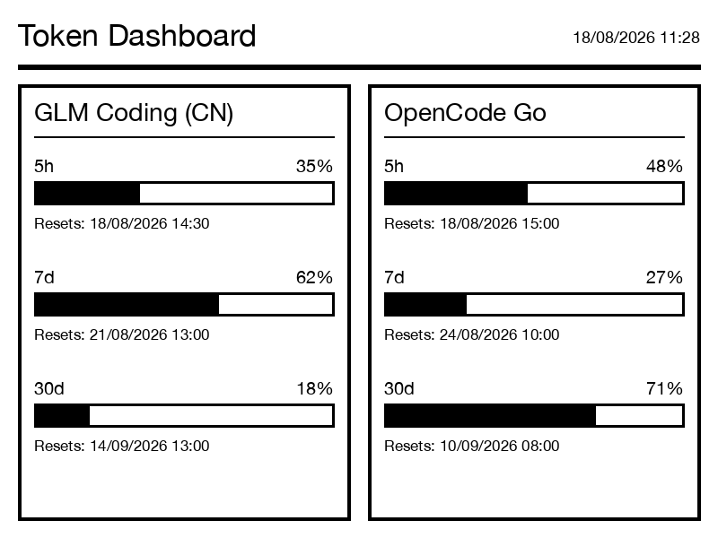

# Kindle Usage Dashboard

A small Mac-side dashboard for a jailbroken Kindle. It displays usage for:

- **GLM Coding (CN)** via `open.bigmodel.cn`
- **OpenCode Go** via `opencode.ai/zen/go/v1/usage`

The visual layout is inspired by the reference [`kindle-dashboard`](https://github.com/alexishida/kindle-dashboard): a title and timestamp, a heavy divider, bordered provider cards, percentage progress bars, and reset times. This repository is independently implemented; it does not copy source code or assets from that project and is not affiliated with or endorsed by it, Zhipu AI/GLM, or OpenCode.

The 800×600 landscape design is rotated into a 600×800 Kindle PNG.

## Preview



This preview uses synthetic values. The live dashboard reads the two provider APIs described below.

## Data and credentials

The fetcher reads existing Pi credentials from `~/.pi/agent/auth.json`:

- `zai-coding-cn` (falls back to `zai`)
- `opencode-go`

No API keys are stored in this repository. The quota cache is written to
`/tmp/kindle-usage.json`.

## Install

The Kindle must already have SSH, `eips`, and USBNetwork/RNDIS configured.

```bash
cd ~/work/hashicorp/kindle-usage-dashboard
cp bin/kindle-usage-*.py bin/kindle-usage-*.sh bin/kindle-usbnet-diagnose.sh ~/bin/
chmod +x ~/bin/kindle-usage-*.py ~/bin/kindle-usage-*.sh ~/bin/kindle-usbnet-diagnose.sh

mkdir -p ~/Library/LaunchAgents
cp launchd/com.larrysong.kindle-usage-dashboard.plist ~/Library/LaunchAgents/
plutil -lint ~/Library/LaunchAgents/com.larrysong.kindle-usage-dashboard.plist
launchctl bootout gui/$(id -u)/com.larrysong.kindle-usage-dashboard 2>/dev/null || true
launchctl bootstrap gui/$(id -u) ~/Library/LaunchAgents/com.larrysong.kindle-usage-dashboard.plist
launchctl kickstart -k gui/$(id -u)/com.larrysong.kindle-usage-dashboard
```

The job refreshes every five minutes and skips the Kindle refresh when quota
values and reset times have not changed. To render without pushing:

```bash
bin/kindle-usage-fetch.py
bin/kindle-usage-png.py --output /tmp/kindle-usage-dashboard.png
```

The default rotation is 270° (`KINDLE_USAGE_ROTATION=270`). Use `0`, `90`, or
`180` if the physical Kindle orientation differs.

## Useful diagnostics

```bash
bin/kindle-usbnet-diagnose.sh --log
bin/kindle-usbnet-diagnose.sh --fix --log
tail -f /tmp/kindle-usage-dashboard.out.log /tmp/kindle-usage-dashboard.err.log
```
